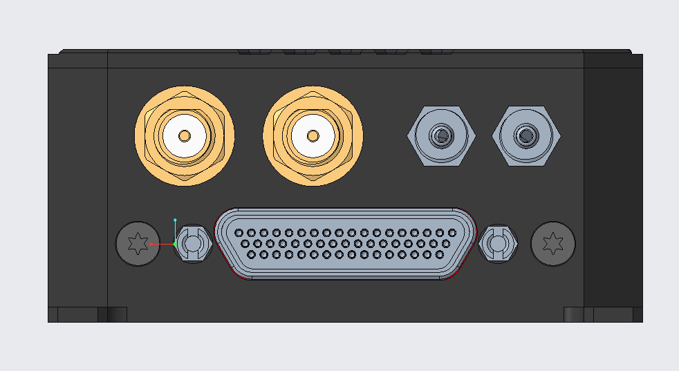
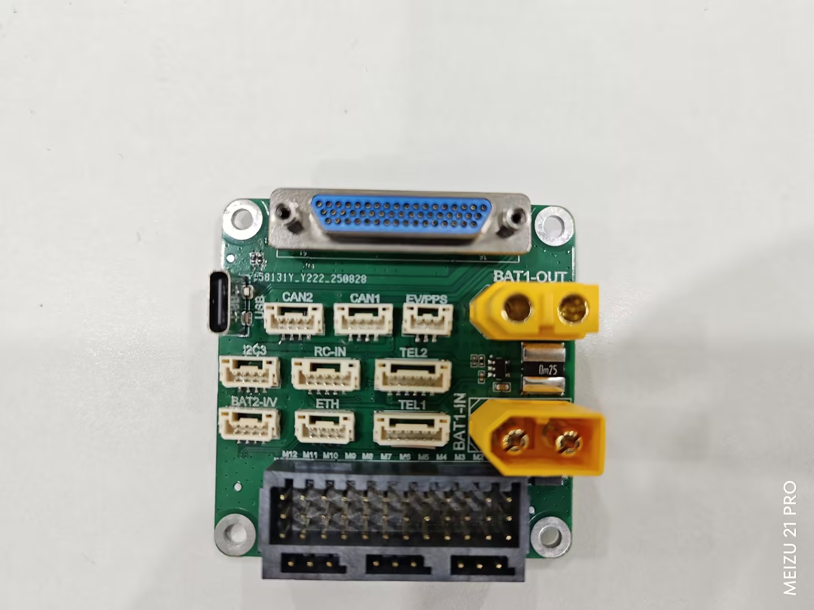
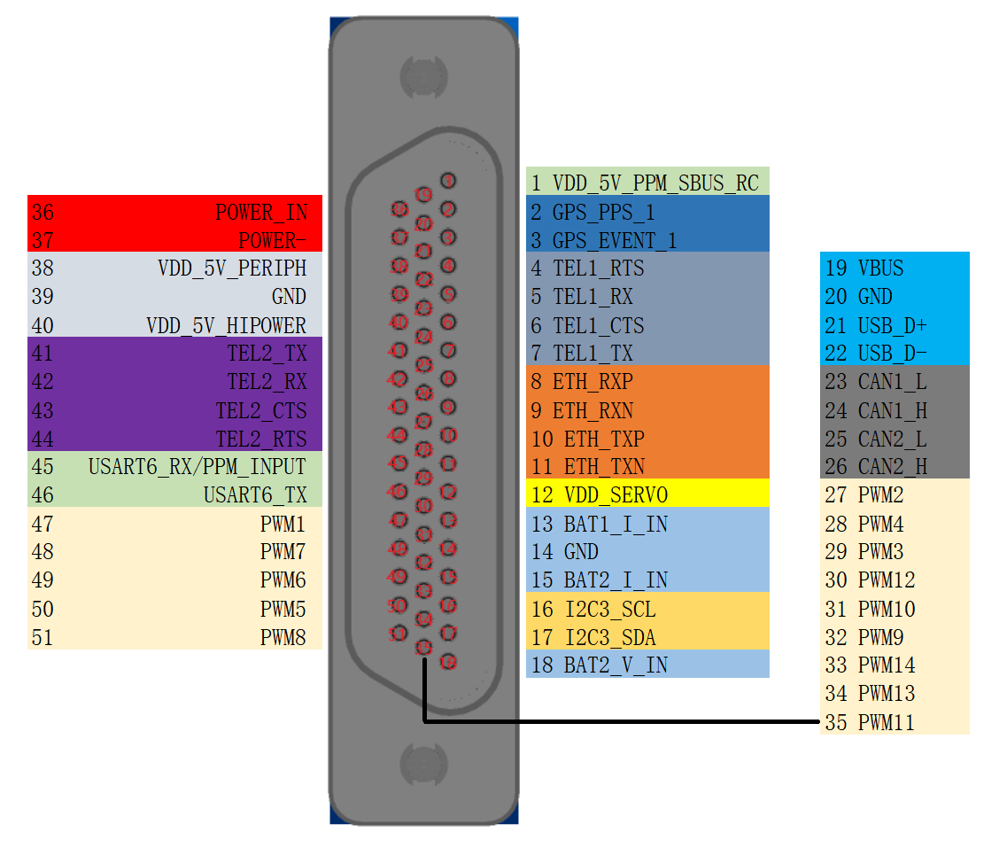

# Holybro Aeolus Flight Controller

The Holybro Aeolus is a flight controller produced by [Holybro](https://holybro.com/).

## Features

- MCU - STM32H753 32-bit processor running at 480 MHz, 2MB flash, 1MB RAM
- Triple IMU - ICM45686 with BalancedGyro Technology (two vibration-isolated)
- Dual Barometer - ICP-20100
- Builtin Compass - RM3100 and IST8310
- Builtin Airspeed Sensor - MS4525 with dynamic and static air holes
- Builtin GNSS - 2x Ublox NEO-F9P with dual antenna ports
- SD NAND flash (soldered, not removable)
- FRAM (FM25V02) for parameter storage
- Ethernet (LAN8742A RMII PHY)
- 7x UARTs plus dual USB
- 2x CAN ports
- 14x PWM outputs (12 with DShot, channels 1-12 support bi-directional DShot)
- IMU heater with temperature control
- Dual battery monitoring (132A max current sensing)
- Servo rail voltage sensing (0-10V)
- Spektrum satellite connector with software power control
- GPS1 Event and PPS port
- Builtin RGB LED
- External safety switch support
- External buzzer
- PWM voltage selection (3.3V or 5V)
- I2C port for external peripherals
- DFU boot support
- USB Type-C input
- Power input: 10-52V via XT60-M (60A continuous, 120A burst)
- J30J-51ZKNP5-J military micro-circular connector
- Operating temperature: -25C to 85C
- Dimensions: 109.7 x 60.17 x 27.6mm
- Mounting holes: 104.7 x 54.77mm
- Weight: 157g

## Pinout

## Connectors

The board uses a J30J-51ZKNP5-J 51-pin military micro-circular connector for all peripheral connections.

### Telem1, Telem2 ports

   | Pin | Signal | Volt |
| --- | --- | --- |
| 1 (red) | VCC | +5V |
| 2 (blk) | TX (OUT) | +3.3V |
| 3 (blk) | RX (IN) | +3.3V |
| 4 (blk) | CTS | +3.3V |
| 5 (blk) | RTS | +3.3V |
| 6 (blk) | GND | GND |

### CAN1, CAN2 ports

   | Pin | Signal | Volt |
| --- | --- | --- |
| 1 (red) | VCC | +5V |
| 2 (blk) | CANH | +3.3V |
| 3 (blk) | CANL | +3.3V |
| 4 (blk) | GND | GND |

### I2C3 port

   | Pin | Signal | Volt |
| --- | --- | --- |
| 1 (red) | VCC | +5V |
| 2 (blk) | SCL | +3.3V |
| 3 (blk) | SDA | +3.3V |
| 4 (blk) | GND | GND |

### EV/PPS port (GPS1)

   | Pin | Signal | Volt |
| --- | --- | --- |
| 1 (red) | VCC | +5V |
| 2 (blk) | GPS_EVENT | +3.3V |
| 3 (blk) | GPS_PPS | +3.3V |
| 4 (blk) | GND | GND |

### RC-IN port

   | Pin | Signal | Volt |
| --- | --- | --- |
| 1 (red) | VCC | +5V |
| 2 (ylw) | PPM/SBUS IN | +3.3V |
| 3 (blk) | UART6 TX | +3.3V |
| 4 (blk) | NC | |
| 5 (blk) | GND | GND |

### BAT2 I/V port

   | Pin | Signal | Volt |
| --- | --- | --- |
| 1 (red) | VCC | +5V |
| 2 (blk) | BAT2_I_IN | +3.3V |
| 3 (blk) | BAT2_V_IN | +10V-100V |
| 4 (blk) | GND | GND |

## UART Mapping

- SERIAL0 -> USB
- SERIAL1 -> UART7 (Telem1, DMA-enabled, flow-control)
- SERIAL2 -> UART5 (Telem2, DMA-enabled, flow-control)
- SERIAL3 -> USART1 (GPS1)
- SERIAL4 -> UART8 (GPS2)
- SERIAL5 -> USART6 (RC Input)
- SERIAL6 -> USART3 (Debug)
- SERIAL7 -> USB2

Telem1 and Telem2 have RTS/CTS flow control pins. The Telem1 port has a 1.5A current limiter; all other ports share a combined 1.5A current limiter.

## RC Input

RC input is configured by default on USART6 (SERIAL5). It supports all serial RC protocols except PPM. The default protocol is set to RC Input (protocol 23).

A dedicated Spektrum satellite port is also provided with software power control.

## PWM Output

The Holybro Aeolus supports up to 14 PWM outputs. The first 12 outputs support DShot, and channels 1-12 support bi-directional DShot. The default PWM signal voltage is 3.3V, selectable to 5V via GPIO 81.

The PWM outputs are in 4 groups:

- PWM 1-4 in group1 (TIM5)
- PWM 5-8 in group2 (TIM4)
- PWM 9-12 in group3 (TIM1)
- PWM 13-14 in group4 (TIM12, no DMA)

Channels within the same group need to use the same output rate. If any channel in a group uses DShot then all channels in the group need to use DShot. PWM 13 and 14 do not support DMA and cannot use DShot.

The servo rail accepts 0-10V input.

## Battery Monitoring

The board has a built-in voltage and current sensor on the XT60-M power input (Battery 1) and a separate external Battery 2 port. The XT60-M supports up to 132A current sensing.

The correct battery setting parameters are:

- :ref:`BATT_MONITOR<BATT_MONITOR>` 4
- :ref:`BATT_VOLT_PIN<BATT_VOLT_PIN__AP_BattMonitor_Analog>` 12
- :ref:`BATT_CURR_PIN<BATT_CURR_PIN__AP_BattMonitor_Analog>` 13
- :ref:`BATT_VOLT_MULT<BATT_VOLT_MULT__AP_BattMonitor_Analog>` 18.18
- :ref:`BATT_AMP_PERVLT<BATT_AMP_PERVLT__AP_BattMonitor_Analog>` 36.36

A second battery monitor is also available via the BAT2 I/V port:

- :ref:`BATT2_MONITOR<BATT2_MONITOR>` 4
- :ref:`BATT2_VOLT_PIN<BATT2_VOLT_PIN__AP_BattMonitor_Analog>` 10
- :ref:`BATT2_CURR_PIN<BATT2_CURR_PIN__AP_BattMonitor_Analog>` 6

## CAN

The board has two CAN ports for DroneCAN peripherals. Both CAN ports are active by default.

## Compass

The Holybro Aeolus has builtin RM3100 and IST8310 compasses on the internal I2C bus. External I2C compasses are also supported via the GPS and I2C ports.

## GNSS

The board has two builtin Ublox NEO-F9P GNSS receivers connected to SERIAL3 (GPS1) and SERIAL4 (GPS2), with two external antenna ports. A GPS Event and PPS port is provided for GPS1 timing applications.

## Ethernet

The board has an Ethernet port using the LAN8742A RMII PHY. Ethernet power can be controlled via the Ethernet_PWR_EN pin.

## Airspeed Sensor

The board has a builtin MS4525 airspeed sensor connected via I2C, with integrated dynamic and static air holes for pitot tube measurement.

## IMU Heater

The IMU heater can be controlled with the BRD_HEAT_TARG parameter, which is in degrees C. The default target temperature is 45C.

## GPIOs

The 14 PWM outputs can be used as GPIOs (relays, buttons, RPM etc). To use them you need to limit the number of these pins that is used for PWM by setting the BRD_PWM_COUNT to a number less than 14. For example if you set BRD_PWM_COUNT to 12 then PWM13 and PWM14 will be available for use as GPIOs.

The numbering of the GPIOs for PIN variables in ArduPilot is:

- PWM1 50
- PWM2 51
- PWM3 52
- PWM4 53
- PWM5 54
- PWM6 55
- PWM7 56
- PWM8 57
- PWM9 58
- PWM10 59
- PWM11 60
- PWM12 61
- PWM13 62
- PWM14 63

In addition, GPIO 81 controls the PWM voltage selection. Setting it low selects 3.3V and setting it high selects 5V. The default is 3.3V.

## Loading Firmware

Initial firmware load can be done with DFU by plugging in USB with the bootloader button pressed. Then you should load the "with_bl.hex" firmware, using your favourite DFU loading tool.

Once the initial firmware is loaded you can update the firmware using any ArduPilot ground station software. Updates should be done with the \*.apj firmware files.
