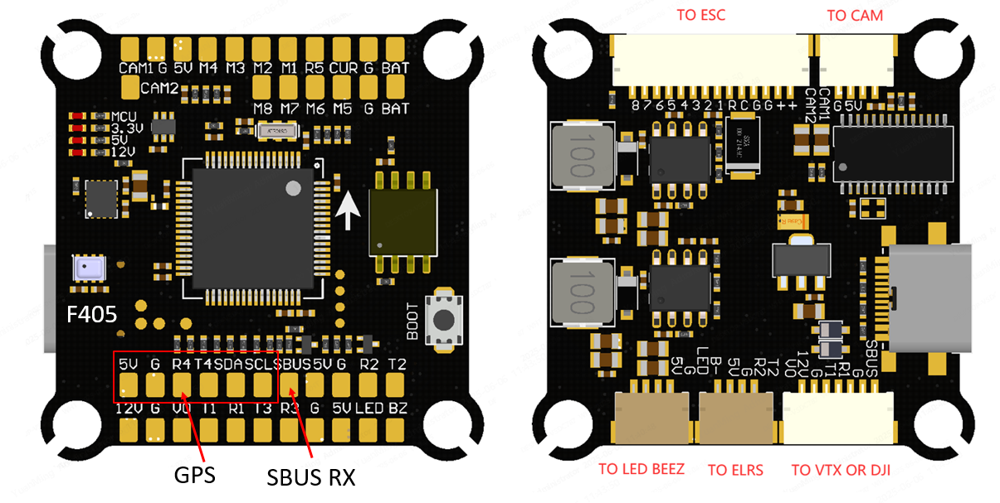

# SPEDIX F405 Flight Controller

The SPEDIX F405 is a flight controller based on the STM32F405 MCU.

## Features

* MCU - STM32F405 32-bit processor running at 168 MHz
* IMU - ICM42688
* Barometer - SPL06
* OSD - AT7456E
* Onboard Flash: 4MByte
* 6x UARTs
* 9x PWM Outputs (8 Motor Output, 1 LED)
* Battery input voltage: 2S-6S
* BEC 3.3V 0.5A
* BEC 5V 3A
* BEC 9V 3A for video

## Pinout

## UART Mapping

* SERIAL0 -> USB
* SERIAL1 -> UART1 (MSP DisplayPort, DMA-enabled)
* SERIAL2 -> UART2 (RX)
* SERIAL3 -> UART3 (Spare, DMA-enabled)
* SERIAL4 -> UART4 (VTX)
* SERIAL5 -> UART5 (ESC Telemetry)
* SERIAL6 -> UART6 (GPS)

## RC Input

RC input is configured by default via the USART2 RX input. It supports all serial RC protocols except PPM.

Note: If the receiver is FPort the receiver must be tied to the USART2 TX pin , RSSI_TYPE set to 3,
and SERIAL2_OPTIONS must be set to 7 (invert TX/RX, half duplex). For full duplex like CRSF/ELRS use both
RX2 and TX2 and set RSSI_TYPE also to 3.

## FrSky Telemetry
 
FrSky Telemetry is supported using an unused UART, such as the T3 pin (UART3 transmit).
You need to set the following parameters to enable support for FrSky S.PORT:
 
  - SERIAL3_PROTOCOL 10
  - SERIAL3_OPTIONS 7

## OSD Support

OSD is supported via the AT7456E chip connected to SPI2.

## PWM Output

The SPEDIX F405 supports up to 9 PWM outputs. The pads for motor output
M1 to M8 are provided on both the motor connectors and on separate pads, plus
M9 on a separate pad for LED strip or another PWM output.

The PWM is in 4 groups:

* PWM 1-4 in group1
* PWM 5-6 in group2
* PWM 7-8 in group3
* PWM 9 in group4

Channels within the same group need to use the same output rate. If
any channel in a group uses DShot then all channels in the group need
to use DShot. Channels 1-4 support bi-directional dshot.

## Battery Monitoring

The board has a built-in voltage sensor and external current sensor input. The voltage sensor can handle up to 6S
LiPo batteries.

The correct battery setting parameters are:

* BATT\_MONITOR 4
* BATT\_VOLT\_PIN 12
* BATT\_CURR\_PIN 11
* BATT\_VOLT\_MULT 11
* BATT\_AMP\_PERVLT 50

## Compass

The board has no onboard compass. External compass modules can be connected via the I2C bus (SDA/SCL).

## Camera control

GPIO 82 controls the camera output to the connectors marked "CAM1" and "CAM2". Setting this GPIO low switches the video output from CAM1 to CAM2. By default RELAY3 is configured to control this pin and sets the GPIO high.

GPIO 81 is a pin for PWM camera control which is not supported by ArduPilot. It can be used as a general GPIO pin. By default RELAY2 is configured to control this pin and sets the GPIO high.

## Firmware

Firmware for the SPEDIX F405 is available from [ArduPilot Firmware Server](https://firmware.ardupilot.org) under the `SPEDIX_F405` target.

## Loading Firmware

To flash firmware initially, connect USB while holding the bootloader button and use DFU to load the `with_bl.hex` file. Subsequent updates can be applied using `.apj` files through a ground station.
