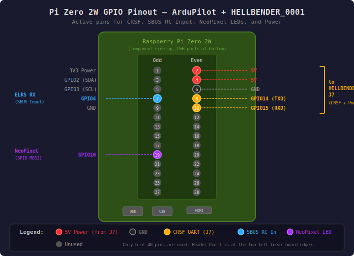

# Build and Wiring Guide: Pi Zero 2W + HELLBENDER_0001

## Overview

This is a split-architecture flight controller:

- **Pi Zero 2W** — Runs ArduPilot (ArduCopter). Handles navigation, EKF, mission planning, and RC input.
- **HELLBENDER_0001** — Runs Betaflight on an RP2350B MCU. Handles rate-loop PID control, motor output (DShot), and onboard sensor reading (IMU, barometer, GPS, compass).

The two boards communicate via **CRSF protocol** over a single full-duplex UART link:

- **ArduPilot to Betaflight:** RC channel data (attitude/throttle commands via CRSF Output)
- **Betaflight to ArduPilot:** IMU acc/gyro, barometer, GPS, and compass data via CRSF telemetry

ArduPilot runs with feedforward-only rate control (all PID gains zeroed), delegating rate stabilization entirely to Betaflight.

```
ELRS RX --[SBUS]--> Pi Zero 2W (ArduPilot)
                         |
                         | SERIAL1: CRSF Output (RC channels)
                         | /dev/serial0 (GPIO14/15 PL011 UART)
                         v
                    HELLBENDER (Betaflight)
                         |
                    ^    |--[DShot]--> ESCs --> Motors
                    |    |
                    |    CRSF Telemetry (IMU, Baro, GPS, Compass)
                    |
              GPS --[UART]--> J5 (UART0)
           Compass --[I2C]--> J6 (I2C1)
```

## Hardware

### HELLBENDER_0001 Board

The HELLBENDER_0001 ("Laurel Flight Controller" by Hellbender Inc) is an RP2350B-based flight controller. Schematic reference: `4602-000116 Rev B`.

Key onboard components:

| Component | Part | Notes |
|-----------|------|-------|
| MCU | RP2350B | Dual Cortex-M33 + dual RISC-V |
| IMU | ICM-42688-P | 6-axis, SPI0 |
| Barometer | DPS310 | I2C0 |
| OSD | AT7456E | SPI1 (optional, unpopulated variant) |
| 5V BEC | LMR33630 | 3A, 6-27V input |
| 9V BEC | LMR33630 | 3A, 9.5-27V input |
| Boot Flash | W25Q64JV | 64Mbit QSPI |
| Blackbox Flash | W25Q128JV | 128Mbit QSPI |

### Connector Reference

All signal connectors are JST SH series (1.0mm pitch), surface mount.

| Connector | Part Number | Pins | Function |
|-----------|-------------|------|----------|
| J1 | SM08B-SRSS-TB | 8 | ESC (motors, VBAT, current, telemetry) |
| J2 | SM04B-SRSS-TB | 4 | FTRX (unused in this build) |
| J5 | SM06B-SRSS-TB | 6 | DVTX (GPS UART in this build) |
| J6 | SM04B-SRSS-TB | 4 | I2C (compass) |
| J7 | SM04B-SRSS-TB | 4 | GNSS (CRSF to Pi Zero 2W in this build) |
| J8 | SM03B-SRSS-TB | 3 | 1-Wire LED strip |
| J9 | USB-C | - | USB (firmware flash, Betaflight CLI) |
| J10 | SM04B-SRSS-TB | 4 | Aux UART (spare) |
| J11 | SM06B-SRSS-TB | 6 | Spare IO |

## Wiring

### Pi Zero 2W GPIO Pinout



Only 6 of the 40 header pins are used. All active pins are in the top 10 rows of the header.

### Pi Zero 2W to HELLBENDER J7 (CRSF + Power)

The Pi Zero 2W connects to the HELLBENDER via **J7** (GNSS connector). This provides both the CRSF UART link and 5V power from the onboard BEC.

Both boards use 3.3V logic levels. No level shifter is required. UART lines have 27 ohm series resistors on the HELLBENDER side. The 5V BEC (LMR33630, 3A max) powers the Pi through this connection.

The Pi's PL011 hardware UART must be enabled — see [README.md](README.md) for PiOS configuration.

**J7 Pinout:**

| J7 Pin | Silk | Net | Pi Zero 2W |
|--------|------|-----|------------|
| 1 | 5V_2 | GNSS_VOUT (5V BEC via FB5) | Pin 2 or 4 (5V) |
| 2 | GND2 | GND | Pin 6 (GND) |
| 3 | RX1 | UART1_RX (PA9) | Pin 8 (GPIO14 / TXD) |
| 4 | TX1 | UART1_TX (PA8) | Pin 10 (GPIO15 / RXD) |

### GPS to HELLBENDER J5 (UART0)

The GPS module connects to the UART pins on **J5** (DVTX connector). Betaflight reads the GPS via UART0 and forwards position data to ArduPilot over CRSF telemetry.

**J5 Pinout:**

| J5 Pin | Silk | Net | GPS Module |
|--------|------|-----|------------|
| 1 | SBUS | DVTX_SBUS_RX (PA36) | — |
| 2 | RX0 | UART0_RX (PA13) | GPS TX |
| 3 | GND4 | GND | GPS GND |
| 4 | 9V0 | BEC_9V0 | — |
| 5 | TX0 | UART0_TX (PA12) | GPS RX |
| 6 | 3V3 | 3.3V | GPS VCC |

### Compass to HELLBENDER J6 (I2C)

An external I2C magnetometer connects to **J6**. Betaflight auto-detects the compass chip, reads it, and forwards data to ArduPilot via CRSF telemetry.

J6 provides 5V on pin 1 (Betaflight standard), **not** 3.3V Qwiic convention. The I2C bus has 2.2k ohm pull-ups to 3.3V on the HELLBENDER board.

**J6 Pinout:**

| J6 Pin | Silk | Net | Compass |
|--------|------|-----|---------|
| 1 | 5V_3 | I2C_5V0 (5V BEC via FB7) | VCC |
| 2 | GND3 | GND | GND |
| 3 | SDA | EXT_SDA (I2C1, remapped to PA10) | SDA |
| 4 | SCL | EXT_SCL (I2C1, remapped to PA11) | SCL |

### ESC to HELLBENDER J1

**J1 Pinout:**

| J1 Pin | Silk | Function |
|--------|------|----------|
| 1 | VBAT | Battery voltage (input to voltage divider) |
| 2 | GND0 | Ground |
| 3 | CUR | Current sense (ADC) |
| 4 | TELEM | ESC telemetry RX (PA37, UART6) |
| 5 | S1 | Motor 1 DShot (PA28) |
| 6 | S2 | Motor 2 DShot (PA29) |
| 7 | S3 | Motor 3 DShot (PA30) |
| 8 | S4 | Motor 4 DShot (PA31) |

### RC Receiver to Pi Zero 2W (SBUS)

An ELRS receiver connects to the Pi's GPIO4 for RC input via SBUS. See [README.md](README.md) Section 7 for hardware details and pigpio configuration.

| Pi Zero 2W | RC Receiver |
|------------|-------------|
| GPIO4 (Pin 7) | SBUS Output |
| GND (Pin 6) | GND |

**ELRS SBUS Output Configuration:**

ELRS receivers default to CRSF protocol output, not SBUS. Since the Pi Zero 2W uses GPIO bit-banging (pigpio) rather than a hardware UART for RC input, the receiver must be configured to output SBUS instead.

To change the output mode, open the ELRS receiver's web interface (via WiFi) or use the ExpressLRS Lua script on the transmitter:

1. Navigate to the receiver's web UI (connect to the receiver's WiFi AP, typically at `10.0.0.1`)
2. Under **Model** settings, set **Protocol** to **SBUS**
3. Save and reboot the receiver

See the [ExpressLRS output mode documentation](https://www.expresslrs.org/software/serial-protocols/) for full details.

**Note:** The SBUS signal is inverted. The pigpio driver handles inversion in software — no external inverter hardware is needed.

## Building Firmware

### ArduPilot (Pi Zero 2W)

From the ArduPilot repository root (`pr-crsf-external-ahrs-refactor` branch):

```bash
./waf configure --board pizero2w
./waf copter
```

The binary is output to `build/pizero2w/bin/arducopter`. Copy to the Pi:

```bash
scp build/pizero2w/bin/arducopter pi@<pi-ip>:/home/ardupilot/arducopter
```

### Betaflight (HELLBENDER_0001)

From the Betaflight repository (`pr-wolverine` branch):

```bash
make HELLBENDER_0001 EXTRA_FLAGS="-DUSE_MAG"
```

The `EXTRA_FLAGS="-DUSE_MAG"` enables magnetometer support, which is required for compass data forwarding via CRSF telemetry.

Flash via USB-C (J9) using Betaflight Configurator or DFU mode.

## Software Configuration

### ArduPilot Parameters

Full parameter file: [ThingOneFullSetupPiZero2w.param](ThingOneFullSetupPiZero2w.param)

**Startup command** (see [README.md](README.md) Section 4 for systemd service):

```
arducopter --serial0 tcp:0.0.0.0:5770 --serial1 /dev/serial0
```

- `--serial0 tcp:0.0.0.0:5770` — MAVLink2 GCS (TCP server mode)
- `--serial1 /dev/serial0` — CRSF Output to Betaflight (PL011 UART)

**Key parameters:**

| Parameter | Value | Description |
|-----------|-------|-------------|
| **Serial Ports** | | |
| SERIAL0_PROTOCOL | 2 | MAVLink2 (GCS via TCP) |
| SERIAL1_PROTOCOL | 51 | CRSF Output (to Betaflight) |
| SERIAL1_BAUD | 57 | 57600 initial (negotiates higher) |
| **External AHRS** | | |
| EAHRS_TYPE | 9 | CRSF_IMU |
| EAHRS_RATE | 1000 | Update rate (Hz) |
| EAHRS_SENSORS | 15 | All: GPS + IMU + Baro + Compass |
| EAHRS_CRSF_IDX | 0 | First CRSF instance |
| **Navigation** | | |
| AHRS_EKF_TYPE | 3 | EKF3 |
| GPS1_TYPE | 21 | ExternalAHRS |
| COMPASS_EXTERNAL | 1 | External compass |
| COMPASS_ORIENT | 2 | CW180 (matches Betaflight `align_mag`) |
| **Rate Control** | | |
| ATC_RATE_FF_ENAB | 1 | Feedforward enabled |
| ATC_RAT_RLL_FF | 0.095491 | Roll feedforward |
| ATC_RAT_PIT_FF | 0.095491 | Pitch feedforward |
| ATC_RAT_YAW_FF | 0.095491 | Yaw feedforward |
| ATC_RAT_\*_P/I/D | 0 | All PID gains zero (Betaflight handles rates) |
| **Frame** | | |
| FRAME_CLASS | 1 | Quad |
| FRAME_TYPE | 12 | BetaFlightX |
| SCHED_LOOP_RATE | 400 | 400 Hz main loop |
| **CRSF Output Channels** | | |
| SERVO1_FUNCTION | 124 | CRSFOut1 (Roll) |
| SERVO2_FUNCTION | 125 | CRSFOut2 (Pitch) |
| SERVO3_FUNCTION | 126 | CRSFOut3 (Throttle) |
| SERVO4_FUNCTION | 127 | CRSFOut4 (Yaw) |
| **RC Input** | | |
| RC_PROTOCOLS | 1 | CRSF |
| RSSI_TYPE | 3 | ReceiverProtocol |

### Betaflight Configuration

Full config: [ThingTwoFullSetupHellbender.txt](ThingTwoFullSetupHellbender.txt)

Apply via Betaflight CLI (USB-C / J9) or Configurator.

**Serial ports:**

```
serial UART0 2 115200 57600 0 115200
serial UART1 64 115200 57600 0 115200
```

- `UART0` function 2 = GPS (connected via J5)
- `UART1` function 64 = Serial RX / CRSF (connected to Pi via J7)

**CRSF settings:**

```
set crsf_use_negotiated_baud = ON
set crsf_tlm_accgyro = ON
set serialrx_halfduplex = OFF
```

- `crsf_use_negotiated_baud` — Allows ArduPilot to negotiate a faster baud rate (up to 2 Mbaud)
- `crsf_tlm_accgyro` — Sends IMU accelerometer and gyroscope data to ArduPilot via CRSF telemetry

**Compass (I2C):**

```
resource I2C_SCL 2 A11
resource I2C_SDA 2 A10
set mag_i2c_device = 2
set align_mag = CW180
```

**GPS:**

```
feature GPS
set gps_auto_baud = ON
set gps_ublox_acquire_model = AIRBORNE_4G
set gps_update_rate_hz = 5
```

**Motor output:**

```
set dshot_bidir = ON
set rpm_filter_weights = 100,0,80
set rpm_filter_min_hz = 70
```

**Rate profile (Betaflight handles PID):**

```
set p_pitch = 70
set i_pitch = 9
set d_pitch = 35
set f_pitch = 135
set p_roll = 70
set i_roll = 9
set d_roll = 35
set f_roll = 135
set p_yaw = 56
set i_yaw = 2
set f_yaw = 100
```

## PiOS Configuration

See [README.md](README.md) for complete Raspberry Pi OS setup including:

- PL011 hardware UART enablement (disable Bluetooth)
- CPU core isolation (cores 2-3 for ArduPilot)
- Real-time scheduling configuration
- systemd service
- SPI for NeoPixel LEDs (GPIO10)
- pigpio for SBUS RC input (GPIO4)
